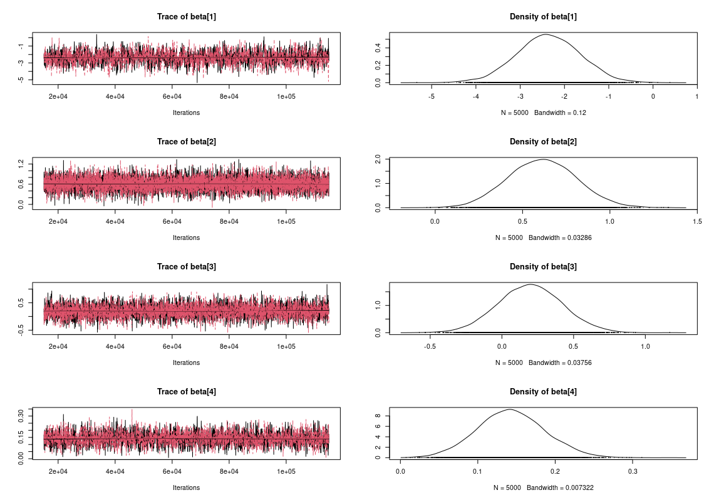
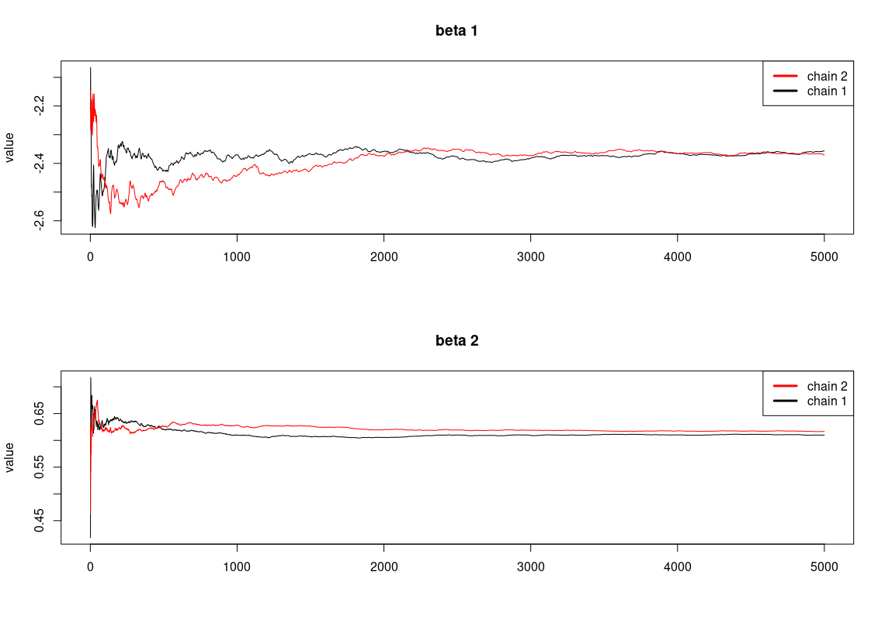
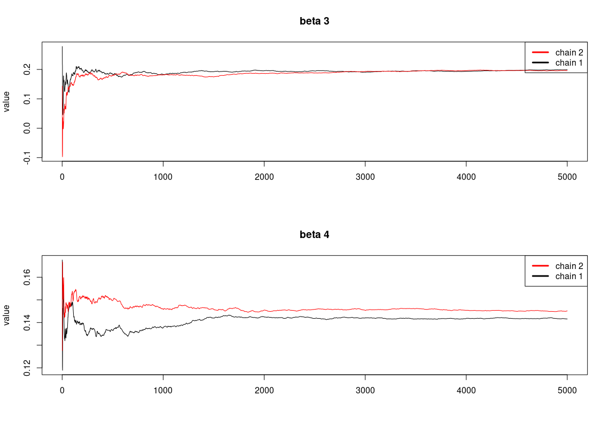
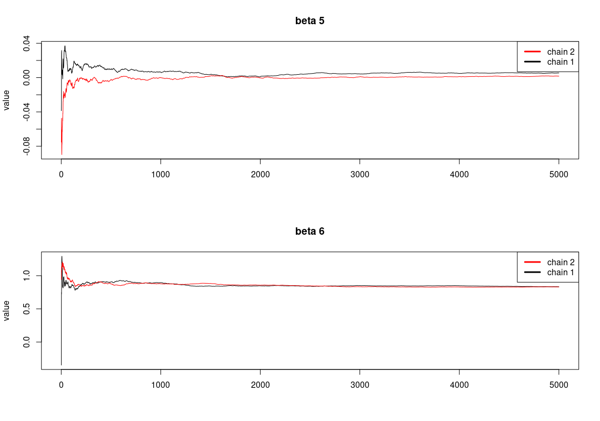
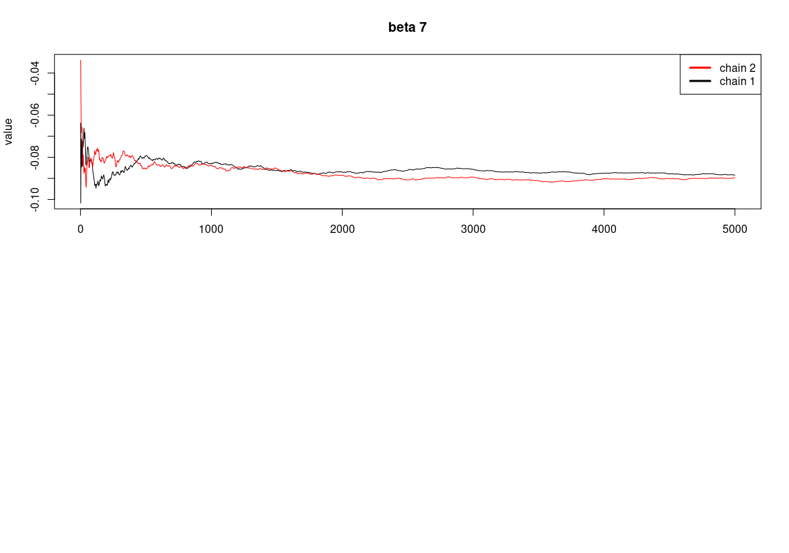

# bayesian-football-match-prediction

Using Bayesian Inference to predict football match wins. 

There is also a notebook on non-bayesian methods for comparison. Using the tradiitional Logistic Regression, Random Forrest, XGBoost, CatBoost and SVC.

[Medium article.](https://medium.com/@adilsaid64/predicting-premier-league-match-wins-using-bayesian-modelling-32eec733472e)

## Traceplots

## Moving Averages Plots

