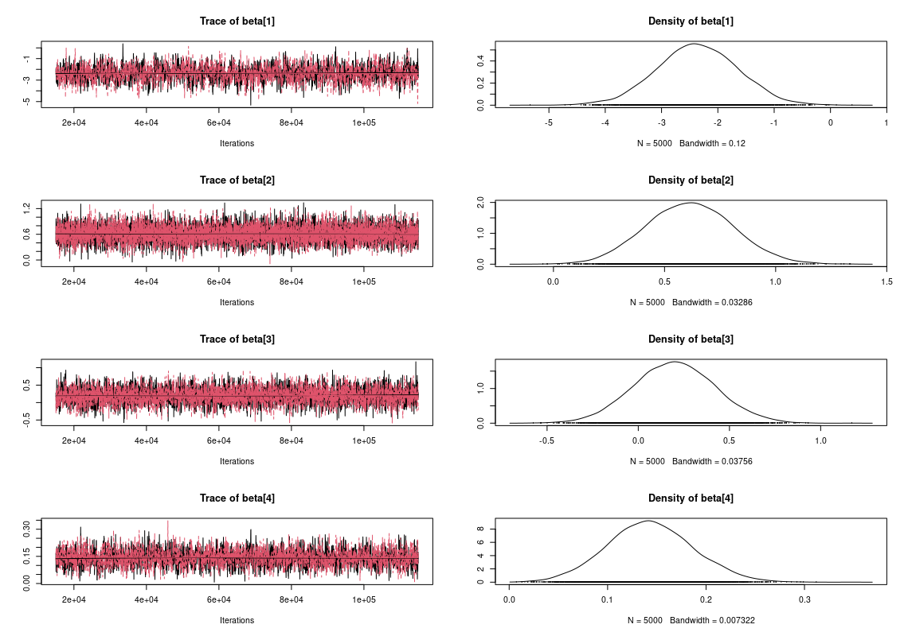
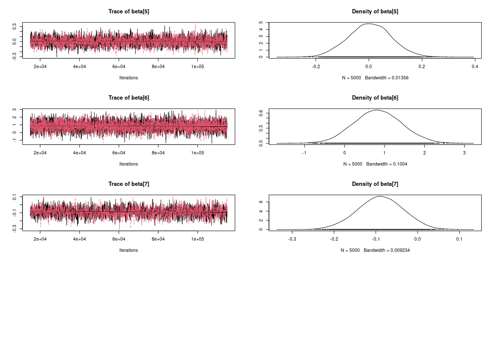
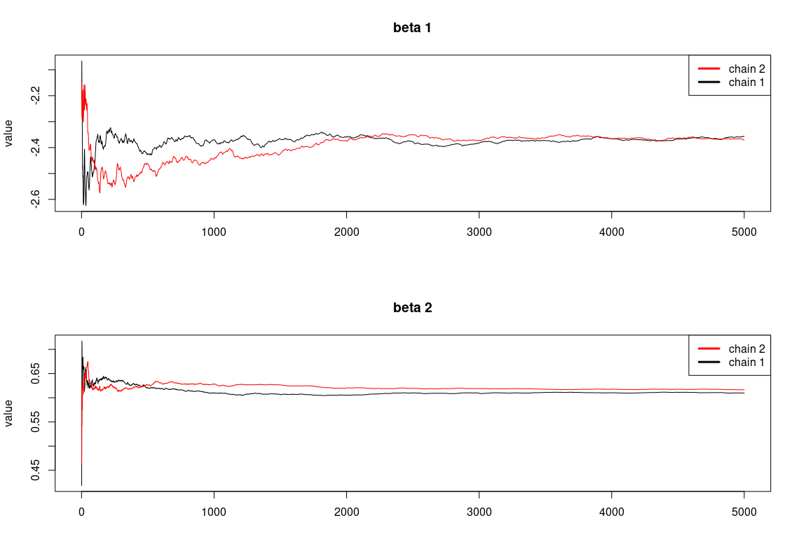
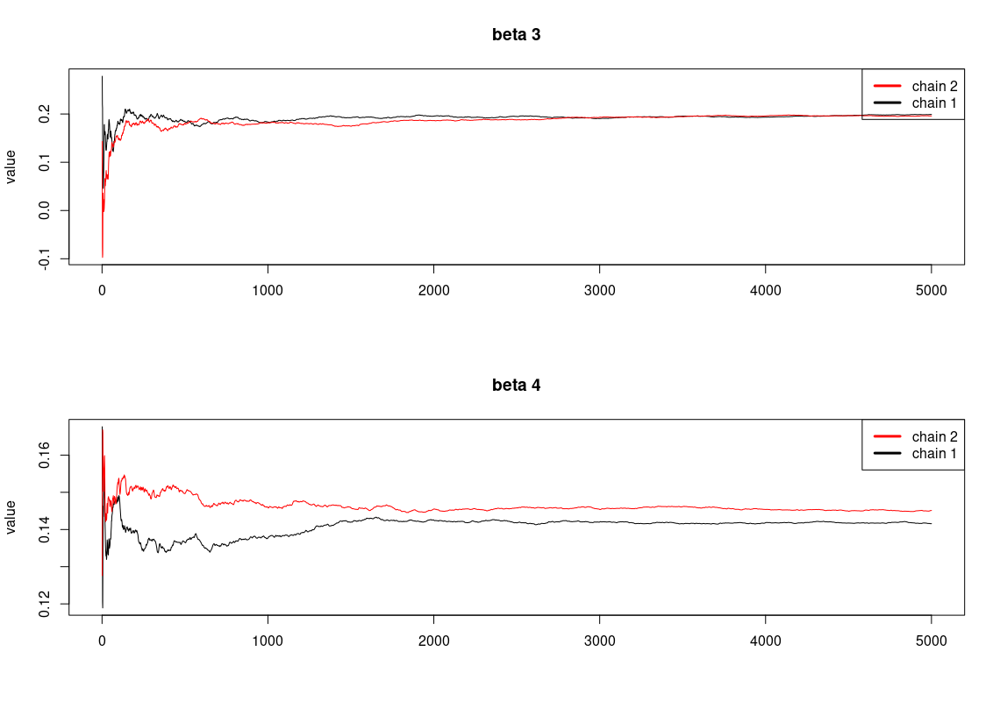
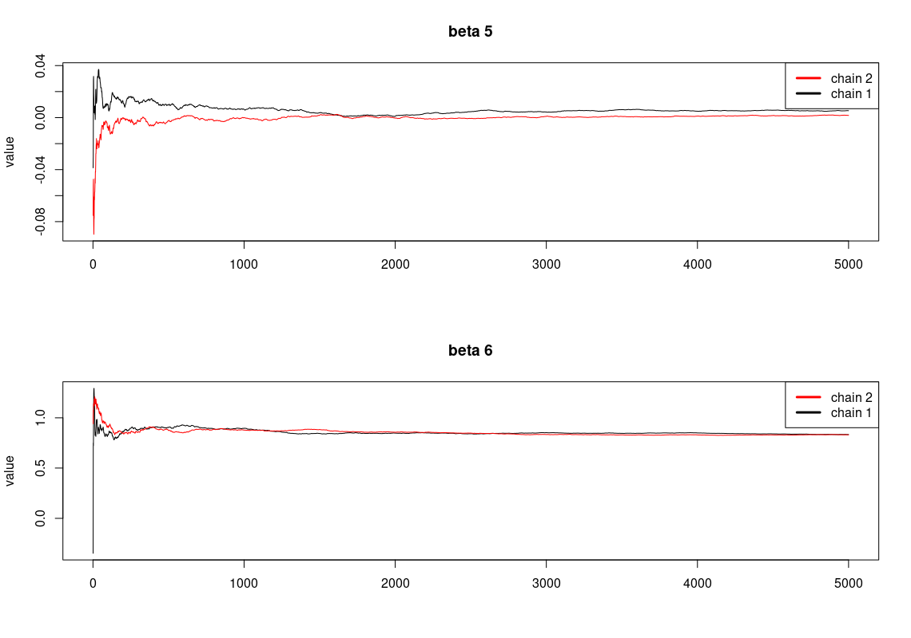
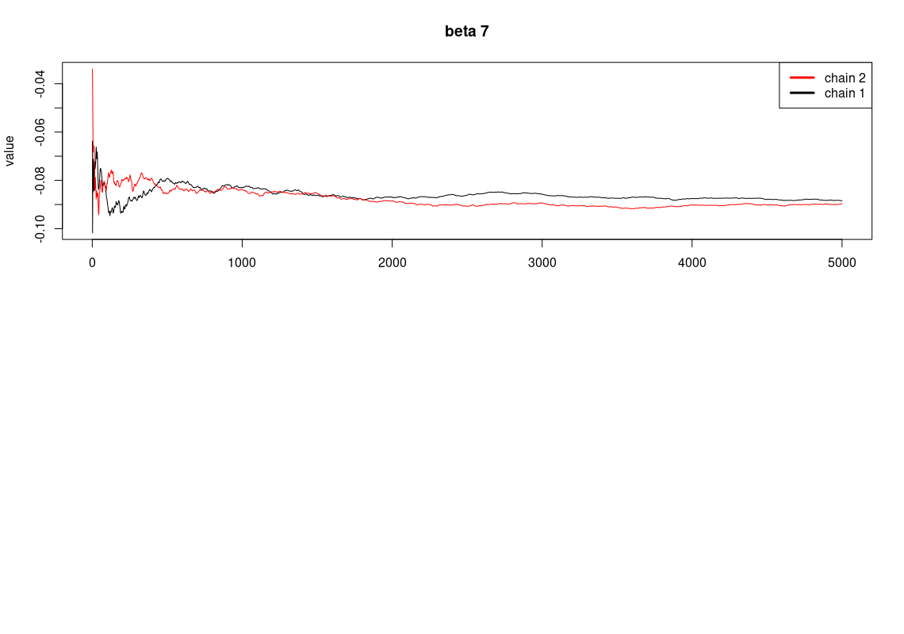

# bayesian-football-match-prediction

Using Bayesian Inference to predict football match wins. 

There is also a notebook on non-bayesian methods for comparison. Using the tradiitional Logistic Regression, Random Forrest, XGBoost, CatBoost and SVC.

Medium article cominig soon.

